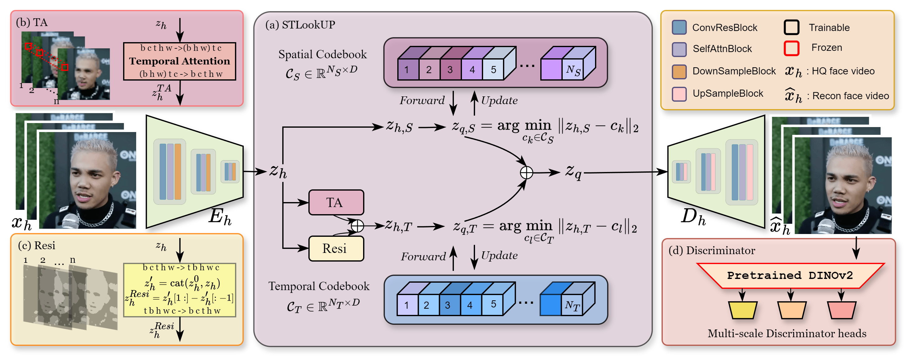

<div align="center">

<h1>Efficient Video Face Enhancement with Enhanced Spatial-Temporal Consistency</h1>
<div>
    <a href='https://yutongwang1012.github.io/' target='_blank'>Yutong Wang</a>&emsp;
    <a href='https://openreview.net/profile?id=~Jiajie_Teng1' target='_blank'>Jiajie Teng</a>&emsp;
    <a href='https://openreview.net/profile?id=~Jiajiong_Cao1' target='_blank'>Jiajiong Cao</a>&emsp;
    <a href='https://openreview.net/profile?id=~Yuming_Li5' target='_blank'>Yuming Li</a>&emsp;
    <a href='https://openreview.net/profile?id=~Chenguang_Ma3' target='_blank'>Chenguang Ma</a>&emsp;
    <a href='https://hongtengxu.github.io/' target='_blank'>Hongteng Xu</a>&emsp;
    <a href='https://dixinluo.github.io/' target='_blank'>Dixin Luo</a>
</div>

<div>
    <h4 align="center">
        <a href="https://arxiv.org/abs/2411.16468" target='_blank'>
        
        </a>
        <a href="https://hhhh1138.github.io/project-page-BFVR-STC/" target='_blank'>
        
        </a>
        </a>
    </h4>
</div>

<p align="center">
  
  
</p>

<p align="center">
  
  <br>
  🔥 For more results, visit our <a href="https://hhhh1138.github.io/project-page-BFVR-STC/"><strong>project page</strong></a> 🔥
  <br>
  ⭐ If you found this project helpful to your projects, please help star this repo. Thanks! 🤗
</p>

</div>

# Getting Started

## Dependencies and Installation

## Quick Inference

### Download Pre-trained Models

### Prepare Testing Data

### Inference

## Citation

   If you find our repo useful for your research, please consider citing our paper:

   ```bibtex

   ```
## Contact

If you have any question, please feel free to contact us via `yutongwang1012@gmail.com`.


